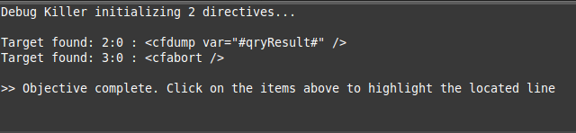

# Sublime Debug Killer
Find debug statements unintentionally left behind in your code. As developers 
and web application builders we sometimes have a need to see more information
in our code and will write debug statements to get what we need. 

Here are some examples in a few languages where you might have debug
statements in code:

```coldfusion
<!-- ColdFusion -->
<cfset qryResult = someDAO.getSomeData(id=12345) />
<cfdump var="#qryResult#" />
<cfabort />
```

```javascript
// JavaScript
resultCallback = function(data) {
   console.log(data);
   if (data.length) {
      // do stuff...
   }
}
```

```php
// PHP
function getData($id) {
   $qryResult = $someDAO.getSomeData($id);
   var_dump($qryResult);
}
```

With this plugin press *CTRL + ALT + K* and you get



For more information visit http://adampresley.github.com/sublime-debugkiller/.